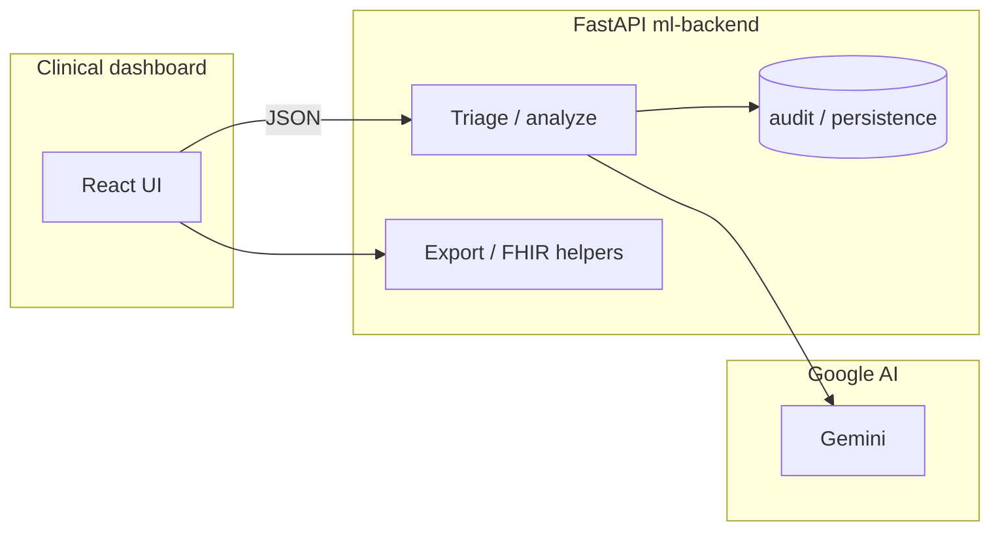

# MediVoice Voice Hospital Scheduling Assistant

Production-ready local stack for **voice-first appointment booking** and **Gemini-powered clinical triage**, with a complete scheduling pipeline:

`Speech → Text → Intent → Scheduling → Calendar → Email`

**Hook ’em Hacks** — patient-centered scheduling with optional Gemini as the clinical orchestrator.

## What’s in this repo

| Piece | Role |
|--------|------|
| **Root app** (`server.ts`, `src/`) | Vite + Express: Twilio voice, proxies to Python services, main React UI (triage + dev console). |
| **Scheduling API** (`app/`) | FastAPI: Fish Audio ASR, OpenAI intent, SQLite booking, Google Calendar, SMTP. Default **port 8001**. Proxied as `/api/scheduling/*`. |
| **ML backend** (`ml-backend/`) | FastAPI: Gemini triage, FHIR-friendly exports, slot recommendations. Default **port 8000**. Proxied as `/api/ml/*`. |
| **`backend/` / `frontend/`** | Optional legacy Gemini + Vite demo layouts; the primary UX is the root `src/` app. |

Environment variables are documented in [`.env.example`](.env.example) (`ML_BACKEND_URL`, `SCHEDULING_API_URL`, `VITE_ML_BACKEND_URL`, `GEMINI_API_KEY`, etc.).

---

## Scheduling architecture

```text
Client (Dev Console / API Client)
        |
        v
FastAPI (`app/main.py`)
  ├─ `/schedule-from-audio` (Fish Audio transcription)
  ├─ `/schedule-from-text` (LLM function calling + parser)
  ├─ `/conversation/turn` (state machine for missing fields)
  └─ `/metrics` (operational counters)
        |
        v
Service Layer (`app/services`)
  ├─ `speech.py` -> Fish Audio ASR
  ├─ `llm.py` -> GPT function-calling JSON intent
  ├─ `scheduler.py` -> SQLite conflict checks + alternatives
  ├─ `calendar.py` -> Google Calendar event creation
  ├─ `email_service.py` -> SMTP Gmail confirmations
  ├─ `conversation.py` -> session memory + field prompts
  └─ `metrics.py` -> request/success/failure/latency tracking
        |
        v
SQLite (`db/app.db`) via SQLAlchemy ORM
  ├─ `appointments`
  └─ `patients`
```

### Tech stack (scheduling)

- Backend: FastAPI + Python
- ORM/Database: SQLAlchemy + SQLite
- Speech-to-text: Fish Audio API
- LLM intent extraction: OpenAI GPT with function calling
- Calendar: Google Calendar API (service account)
- Email: SMTP (Gmail test account)

### Project structure (scheduling)

```text
app/
  main.py
  routes/
  services/
  models/
db/
tests/
```

---

## Clinical intelligence (Gemini, `ml-backend`)

The ML service uses a **lean** pattern: short calls to **Google Gemini** (no on-box heavy ML). From a **voice transcript** (or text in the demo), it can produce triage-style outputs (risk-style scoring, priority bands, rationale) and related APIs for interoperability (e.g. FHIR-oriented flows). See `ml-backend/main.py` and `ml-backend/services/` for current routes (e.g. triage analysis, slot recommendation).

If no API key is configured, **rule-based fallbacks** keep local demos runnable.



---

## Setup

### 1. Root UI + Express

From the repository root:

```bash
npm install
cp .env.example .env
# Edit .env — see comments in .env.example
npm run dev
```

This serves the app (default **http://127.0.0.1:3000**). The dev server proxies **`/api/ml`** → `ML_BACKEND_URL` (default `http://127.0.0.1:8000`) and **`/api/scheduling`** → `SCHEDULING_API_URL` (default `http://localhost:8001`).

### 2. Scheduling FastAPI (`app/`)

```bash
python -m venv .venv
source .venv/bin/activate   # Windows: .venv\Scripts\activate
pip install -r requirements.txt
uvicorn app.main:app --reload --port 8001
```

Fill scheduling-related variables in `.env` (see below).

### 3. ML backend (Gemini)

```bash
cd ml-backend
python -m venv .venv
source .venv/bin/activate
pip install -r requirements.txt
# Set GEMINI_API_KEY (or GOOGLE_API_KEY) in .env at repo root or here
uvicorn main:app --reload --host 0.0.0.0 --port 8000
```

### Required / common `.env` entries (scheduling)

- `OPENAI_API_KEY`
- `FISH_AUDIO_API_KEY`
- `GOOGLE_SERVICE_ACCOUNT_FILE`
- `GOOGLE_CALENDAR_ID`
- `SMTP_SENDER_EMAIL`
- `SMTP_APP_PASSWORD`
- (Optional SMS) `TWILIO_ACCOUNT_SID`, `TWILIO_AUTH_TOKEN`, `TWILIO_PHONE_NUMBER`, `TWILIO_SMS_ENABLED=true`

---

## Twilio SMS (optional)

This repo can send **SMS confirmations** when an appointment is booked via the voice flow.

- Set in `.env`:
  - `TWILIO_SMS_ENABLED=true`
  - `TWILIO_ACCOUNT_SID=...`
  - `TWILIO_AUTH_TOKEN=...`
  - `TWILIO_PHONE_NUMBER=+1...`
- Trial accounts can only send to **verified** numbers and will include a trial banner.

### SMS API endpoint (demo)

```bash
curl -X POST http://localhost:3000/api/sms/send \
  -H "Content-Type: application/json" \
  -d '{"to":"+1YOUR_NUMBER","body":"Your appointment is confirmed for tomorrow at 2 PM."}'
```

---

## Scheduling API endpoints

Served by the scheduling app (direct **:8001** or via **`/api/scheduling`** through Express).

- `POST /schedule-from-audio` — multipart form: `audio`, optional `session_id`, `patient_email`
- `POST /schedule-from-text` — JSON: `{ "text": "...", "session_id": "...", "patient_email": "..." }`
- `POST /conversation/turn` — JSON: `{ "session_id": "...", "message": "...", "patient_email": "..." }`
- `GET /metrics`
- `GET /health`

### Example: schedule from text

```bash
curl -X POST http://localhost:8001/schedule-from-text \
  -H "Content-Type: application/json" \
  -d '{
    "text":"Book Rahul Mehta with Dr. Chen next Friday afternoon for migraine follow-up, high urgency",
    "session_id":"demo-1",
    "patient_email":"rahul@example.com"
  }'
```

Example success response:

```json
{
  "status": "booked",
  "message": "Booked migraine follow-up for Rahul Mehta with Dr. Chen on 2026-04-24 13:00.",
  "appointment_id": 12,
  "intent": {
    "patient_name": "Rahul Mehta",
    "appointment_type": "migraine follow-up",
    "doctor": "Dr. Chen",
    "date": "next Friday",
    "time_preference": "afternoon",
    "urgency": "high"
  },
  "alternatives": [],
  "missing_fields": []
}
```

---

## Demo walkthrough (scheduling)

1. Open Dev Console in the UI.
2. Use **Pipeline Dry Run** to send natural language input.
3. Verify structured output and booking result.
4. Check `/metrics` updates in the same console.
5. Confirm:
   - Appointment persisted in `db/app.db`
   - Google Calendar event created (if configured)
   - Confirmation email received (if SMTP configured)

### Edge cases implemented

- Relative dates like `next Friday`
- Time buckets like `afternoon` → `13:00`
- Invalid date/time returns retry message
- Double-booked slot returns nearest alternatives
- Working-hours guard (`9:00` to `17:00`, 30-minute slots)
- Multi-turn state machine collects missing fields incrementally

---

## Tests

```bash
pytest tests -q
```

Included:

- Scheduler conflict prevention
- Alternative slot generation
- Health endpoint availability

---

## License

Demo / educational use. Not for real clinical decisions without proper validation and governance.
