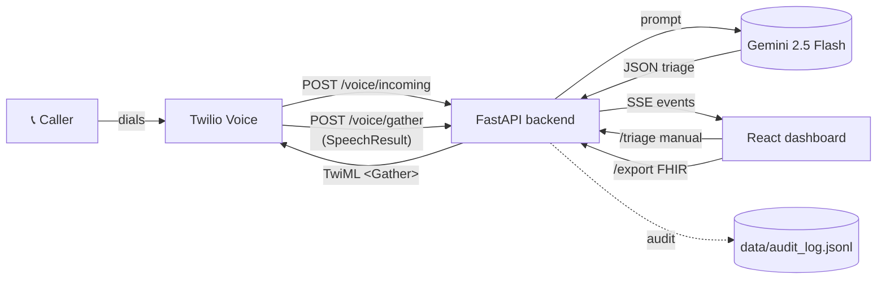

# MediVoice — Voice Hospital Scheduling Assistant

Real-time, voice-first clinical triage dashboard. A patient calls a Twilio
number, describes their symptoms, and **Google Gemini** grades the call with
a 0–100 risk score, a P1/P2/P3 priority, a short clinical rationale, and the
three dominant drivers — all streaming into a React dashboard while the call
is still happening.

```
📞 Patient call → Twilio Voice → FastAPI (/voice/incoming, /voice/gather)
                                         │
                                         ├─ SSE stream ────► React dashboard
                                         │                   (live transcript
                                         │                    + risk gauge)
                                         │
                                         └─ Gemini triage ─► risk_score,
                                                             priority,
                                                             rationale,
                                                             top_drivers
                                                                │
                                                                └─► FHIR export
```

---

## Table of contents

- [What's in the repo](#whats-in-the-repo)
- [Primary app — MediVoice triage (`backend/` + `frontend/`)](#primary-app--medivoice-triage-backend--frontend)
  - [Architecture](#architecture)
  - [Backend API reference](#backend-api-reference)
  - [Frontend features](#frontend-features)
  - [Local setup](#local-setup)
  - [Twilio voice setup (end-to-end)](#twilio-voice-setup-end-to-end)
  - [Gemini setup](#gemini-setup)
  - [Scoring toggle (quota protection)](#scoring-toggle-quota-protection)
  - [FHIR export](#fhir-export)
- [Secondary services](#secondary-services)
  - [Root Vite + Express app (`server.ts`, `src/`)](#root-vite--express-app-serverts-src)
  - [Scheduling FastAPI (`app/`)](#scheduling-fastapi-app)
  - [Gemini ML backend (`ml-backend/`)](#gemini-ml-backend-ml-backend)
- [Environment variable reference](#environment-variable-reference)
- [Troubleshooting](#troubleshooting)
- [Security](#security)
- [Tests](#tests)
- [License](#license)

---

## What's in the repo

This repository evolved through several phases; multiple services coexist
and can be run independently. The **primary working demo** — what we
actively maintain — is the MediVoice triage pair in `backend/` and `frontend/`.

| Path | Role | Default port |
| --- | --- | --- |
| **`backend/`** | FastAPI: Gemini triage, Twilio Voice webhooks (`/voice/incoming`, `/voice/gather`), SSE live stream, FHIR export. **Main working demo.** | **8000** |
| **`frontend/`** | React (Vite + Tailwind): live triage dashboard, status board, FHIR download. **Main working demo.** | **3000** |
| `scripts/` | Helper CLIs (e.g. `set_twilio_webhook.py` to re-point Twilio after a tunnel restart). | — |
| `app/` | Optional FastAPI scheduling service (Fish Audio ASR + OpenAI intent + SQLite + Google Calendar + SMTP). | 8001 |
| `ml-backend/` | Optional standalone Gemini + slot-recommender service (earlier iteration of triage). | 8000 |
| `server.ts`, `src/` | Optional Vite + Express combo app that proxies to `app/` and `ml-backend/`. | 3000 |

> **If you just want the demo working, skip straight to
> [Primary app — MediVoice triage](#primary-app--medivoice-triage-backend--frontend).**

---

## Primary app — MediVoice triage (`backend/` + `frontend/`)

### Architecture



Key design choices:

- **No silent fallback.** If Gemini is misconfigured the backend returns
  HTTP 503/502 so the frontend can surface the error instead of pretending
  the call was scored. `MEDIVOICE_TRIAGE_RULES_ONLY` is ignored.
- **`load_dotenv(override=True)`** — repo-level and backend-level `.env`
  values always win over stale shell/user env vars (this bit us during
  development; we document the fix).
- **Opt-in scoring** on the frontend protects Gemini quota. Nothing calls
  `/triage` automatically until the user clicks **Start Gemini scoring**.
- **One authoritative schema.** Every JSON key (`risk_score`, `priority`,
  `rationale`, `top_drivers`) matches exactly between `backend/main.py`
  Pydantic models and `frontend/src/App.jsx` UI.

### Backend API reference

| Method | Path | Purpose |
| --- | --- | --- |
| `GET` | `/health` | Liveness + reports `{ gemini_model, gemini_configured }`. |
| `POST` | `/triage` | Manual triage of a text transcript. Body: `{ voice_transcript, patient_id?, patient_name? }`. Returns `{ risk_score, priority, rationale, top_drivers, source }`. |
| `POST` | `/export` | Build a FHIR-flavored `RiskAssessment` bundle from a triage result. |
| `GET` | `/voice/stream/sse` | Server-Sent Events: `call_started`, `transcript_partial`, `triage_complete`, `triage_error`, `call_completed`. Dashboard subscribes to this. |
| `POST` | `/voice/incoming` | Twilio webhook. Returns TwiML that greets the caller and opens a `<Gather input="speech">`. |
| `POST` | `/voice/gather` | Twilio `Gather action` callback. Receives `SpeechResult`, kicks off a background Gemini triage, returns a goodbye TwiML. |
| `POST` | `/voice/click-to-call` | Place an outbound Twilio call from the dashboard (click-to-call). |
| `GET` | `/voice/client-token` | Mint a Twilio Voice JS SDK access token (for in-browser dialing). Requires `TWILIO_API_KEY_*` + `TWILIO_VOICE_APP_SID`. |

Triage response shape (authoritative):

```json
{
  "risk_score": 87,
  "priority": "P1",
  "rationale": "Acute chest tightness with exertional dyspnea in an older adult warrants immediate cardiac workup.",
  "top_drivers": ["Chest Pain", "Exertional Dyspnea", "Age > 65"],
  "source": "gemini-2.5-flash"
}
```

The Gemini prompt enforces these keys and a conservative scoring policy
(red-flag symptoms → `risk_score ≥ 80`, `priority = "P1"`). See
`_TRIAGE_SYSTEM` in `backend/main.py`.

### Frontend features

- **Status board** — patient cards auto-sort by `risk_score` descending,
  with tone-mapped badges (Red ≥ 75, Orange 40–74, Green < 40) and a
  gradient risk bar.
- **Clinical workspace** — score gauge, rationale, top 3 clinical drivers
  as chips, priority badge, FHIR download.
- **Live call visualizer** — subscribes to `/voice/stream/sse`; when a
  call is active the card pulses **LIVE CALL IN PROGRESS** and the
  transcript streams in character-by-character with the Gemini result
  appearing a few seconds after the caller stops speaking.
- **Gemini scoring toggle** — master Start/Pause button + per-card
  "Score" action + workspace "Score with Gemini" button. See
  [Scoring toggle (quota protection)](#scoring-toggle-quota-protection).
- **⌘K / Ctrl+K** — focuses the search field.

### Local setup

Two terminals. This stack is intentionally decoupled from the root
`server.ts`/`app/`/`ml-backend/` services — run just `backend/` + `frontend/`.

```bash
# Terminal 1 — backend (port 8000)
cd backend
python -m pip install -r requirements.txt
python -m uvicorn main:app --host 127.0.0.1 --port 8000 --reload
```

On startup you should see:

```
API KEY DETECTED (len=39, prefix=AIzaSy..., model=gemini-2.5-flash)
[medivoice] gemini_model=gemini-2.5-flash key_detected=True
INFO:     Application startup complete.
```

If `key_detected=False`, Gemini is misconfigured — fix the key before
continuing (see [Gemini setup](#gemini-setup)).

```bash
# Terminal 2 — frontend (port 3000)
cd frontend
npm install
npm run dev
```

Open http://localhost:3000. Vite proxies `/triage`, `/export`, `/health`,
and `/voice/stream/sse` to the backend on 8000 — no CORS config needed.

### Twilio voice setup (end-to-end)

Twilio's servers need to reach your local FastAPI. That means a public
HTTPS tunnel.

**1. Put your Twilio credentials in `.env` (repo root).**

```env
TWILIO_ACCOUNT_SID=AC...
TWILIO_AUTH_TOKEN=...
TWILIO_PHONE_NUMBER=+17262394796      # must start with +, E.164 format
```

Trial accounts can receive calls from anyone, but the **outbound**
click-to-call only reaches *verified* caller IDs (add verified numbers in
Twilio Console → Phone Numbers → Manage → Verified Caller IDs).

**2. Start a tunnel.** We use Cloudflare Quick Tunnel because it's free,
signup-free, and returns a plain HTTPS URL that works with Twilio
webhooks. Install once:

```powershell
winget install --id Cloudflare.cloudflared -e
```

Then every time you restart dev:

```powershell
& 'C:\Program Files (x86)\cloudflared\cloudflared.exe' tunnel --url http://localhost:8000
```

Grab the printed `https://<something>.trycloudflare.com` URL.

> ngrok works too — `ngrok http 8000` — but you need a free ngrok account
> and authtoken. Cloudflare has no signup step.

**3. Point `PUBLIC_BASE_URL` at the tunnel** in `.env`:

```env
PUBLIC_BASE_URL=https://<your-tunnel>.trycloudflare.com
```

This URL is used as the absolute `action` on `<Gather>` TwiML and as the
`statusCallback`/`url` for outbound calls. **Restart uvicorn after
editing `.env`** — the process reads env at startup.

**4. Point the Twilio number's voice webhook at your backend.** We ship
a helper:

```bash
python scripts/set_twilio_webhook.py
```

It reads `.env`, calls the Twilio API, and sets the number's voice URL
to `PUBLIC_BASE_URL/voice/incoming` (POST). Idempotent — re-run it every
time the tunnel URL changes.

**5. Test it.** Call your Twilio number. Expected flow:

1. Trial disclaimer plays (skippable on paid accounts).
2. `"Welcome to MediVoice. After the tone, briefly describe how you are feeling today."`
3. `"Go ahead."` ← speak your symptoms.
4. `"Thank you. MediVoice is updating your care team. You may hang up now."`

While the call is going, the dashboard's **LIVE CALL** card pulses, the
transcript streams in, and a Gemini triage result (score + priority + 3
drivers) appears a few seconds after you stop speaking.

> **Cloudflare Quick Tunnel URLs rotate on every restart.** Keep
> `cloudflared` running the whole session. If it dies, start a new one,
> update `PUBLIC_BASE_URL`, restart `uvicorn`, and re-run
> `scripts/set_twilio_webhook.py`.

### Gemini setup

1. Get an API key at https://aistudio.google.com/app/apikey.
2. Add to `.env`:

   ```env
   GEMINI_API_KEY=AIza...
   GEMINI_TRIAGE_MODEL=gemini-2.5-flash
   ```

3. Start the backend — it logs the detected key length and model on
   startup. If `GEMINI_TRIAGE_MODEL` is `gemini-2.0-flash` and you see
   `limit: 0`, your project has zero quota for that model; switch to
   `gemini-2.5-flash` (confirmed working on the free tier).

> **Gotcha we hit:** a stale user-level Windows environment variable
> `GEMINI_API_KEY` silently overrode the `.env` value. The backend now
> uses `load_dotenv(..., override=True)` to prevent this, but if you
> still have an invalid user-level env var, clear it:
>
> ```powershell
> [Environment]::SetEnvironmentVariable('GEMINI_API_KEY', $null, 'User')
> ```

### Scoring toggle (quota protection)

The dashboard **will not hit Gemini** unless you ask it to. On page load,
every patient card shows a small `▶ Score` button instead of a number,
and the status board header has a prominent **Start Gemini scoring**
button.

| Control | What it does |
| --- | --- |
| **Start Gemini scoring** (header) | Triages every patient sequentially, then enables per-selection rescoring. Flips to **Gemini: ON / Pause** while active. |
| **Rescore** (header, while ON) | Clears the cache and re-runs Gemini on every card. |
| **▶ Score** (per card, while OFF) | Triage only this one patient. |
| **Score with Gemini** (workspace, when a patient is selected and unscored) | Triage only the currently selected patient. |

The enabled/disabled state persists to `localStorage`
(`medivoice:scoring-enabled`) so Vite HMR and refreshes don't silently
re-enable it. The bulk loop deduplicates against patients that are
already scored or currently in-flight so flipping OFF then ON is a
no-op for finished cards.

### FHIR export

From the clinical workspace, **Download FHIR** calls `POST /export`
with the live triage result (`risk_score`, `priority`, `rationale`,
`top_drivers`) and saves a `RiskAssessment_<patient_id>.json` bundle to
disk. The bundle uses the actual Gemini output — not the mock transcript
or any fallback.

---

## Secondary services

These are kept around from earlier iterations. They're not required for
the Twilio + Gemini demo described above.

### Root Vite + Express app (`server.ts`, `src/`)

An alternate UI that embeds a dev console, proxies `/api/ml/*` to the
`ml-backend/` FastAPI and `/api/scheduling/*` to the `app/` FastAPI, and
can send SMS confirmations via Twilio.

```bash
npm install
npm run dev     # starts tsx server.ts on :3000
```

Configure `ML_BACKEND_URL`, `SCHEDULING_API_URL`, and the optional SMS
variables (`TWILIO_SMS_ENABLED=true`) in `.env`. The demo SMS endpoint:

```bash
curl -X POST http://localhost:3000/api/sms/send \
  -H "Content-Type: application/json" \
  -d '{"to":"+1YOUR_NUMBER","body":"Your appointment is confirmed."}'
```

### Scheduling FastAPI (`app/`)

Voice → text → intent → booking pipeline backed by SQLite + Google
Calendar + SMTP.

```bash
python -m venv .venv
.venv\Scripts\activate        # macOS/Linux: source .venv/bin/activate
pip install -r requirements.txt
uvicorn app.main:app --reload --port 8001
```

Endpoints:

- `POST /schedule-from-audio` — multipart: `audio`, optional
  `session_id`, `patient_email`.
- `POST /schedule-from-text` — `{ text, session_id, patient_email }`.
- `POST /conversation/turn` — multi-turn state machine for missing
  fields.
- `GET /metrics` — operational counters.
- `GET /health`.

Example:

```bash
curl -X POST http://localhost:8001/schedule-from-text \
  -H "Content-Type: application/json" \
  -d '{
    "text":"Book Rahul Mehta with Dr. Chen next Friday afternoon for migraine follow-up, high urgency",
    "session_id":"demo-1",
    "patient_email":"rahul@example.com"
  }'
```

Edge cases handled: relative dates (`next Friday`), time buckets
(`afternoon` → `13:00`), double-booking with nearest alternatives,
working-hours guard (09:00–17:00 in 30-min slots), multi-turn follow-ups.

### Gemini ML backend (`ml-backend/`)

Earlier standalone Gemini + slot-recommender service. The primary
working Gemini path lives in `backend/` now; `ml-backend/` stays for
slot-recommendation endpoints used by the root app.

```bash
cd ml-backend
pip install -r requirements.txt
uvicorn main:app --reload --port 8000
```

Note the port collision with `backend/` — only run one at a time, or
move one to `:8001` via `ML_BACKEND_URL`.

---

## Environment variable reference

All the envs the repo knows about. Copy `.env.example` → `.env` and fill
in what you need; everything is optional except Gemini and Twilio for
the main demo.

### MediVoice primary demo (`backend/` + `frontend/`)

| Variable | Purpose |
| --- | --- |
| `GEMINI_API_KEY` | Google AI Studio API key. **Required.** |
| `GEMINI_TRIAGE_MODEL` | Model id (default `gemini-2.0-flash`, recommended `gemini-2.5-flash`). |
| `GEMINI_THREAD_TIMEOUT` | Seconds (default ~48, must stay < browser ~55s). |
| `TWILIO_ACCOUNT_SID` | From Twilio Console. **Required for voice.** |
| `TWILIO_AUTH_TOKEN` | From Twilio Console. **Required for voice.** |
| `TWILIO_PHONE_NUMBER` | E.164, must start with `+`. **Required for voice.** |
| `PUBLIC_BASE_URL` | Public HTTPS base (tunnel URL or Render URL). **Required for voice.** |
| `TWILIO_API_KEY_SID` | Optional — for browser "Dial from browser" (Voice JS SDK). |
| `TWILIO_API_KEY_SECRET` | Optional — paired with the API Key SID. |
| `TWILIO_VOICE_APP_SID` | Optional — TwiML App SID for browser dialing. |
| `ELEVENLABS_API_KEY` / `ELEVENLABS_VOICE_ID` | Optional TTS override. |

### Root Vite + Express / Render deploys

| Variable | Purpose |
| --- | --- |
| `ML_BACKEND_URL` | Where `server.ts` proxies `/api/ml/*`. Default `http://127.0.0.1:8000`. |
| `SCHEDULING_API_URL` | Where `server.ts` proxies `/api/scheduling/*`. Default `http://localhost:8001`. |
| `VITE_ML_BACKEND_URL` | Build-time browser-direct origin for the ML service (CORS must allow frontend). |
| `VITE_SCHEDULING_API_URL` | Build-time browser-direct origin for the scheduling service. |
| `VITE_SKIP_AUTH` | `true` to skip the Google login screen locally. |
| `CORS_ORIGINS` | Comma-separated allowed origins on the FastAPI services. |
| `TWILIO_SMS_ENABLED` | `true` to enable `/api/sms/send`. |
| `APP_URL` | Self-referential URL (Cloud Run injects automatically). |

### Scheduling FastAPI (`app/`)

| Variable | Purpose |
| --- | --- |
| `OPENAI_API_KEY` | LLM intent extraction. |
| `OPENAI_MODEL` | Default `gpt-4o-mini`. |
| `DATABASE_URL` | Default `sqlite:///./db/app.db`. |
| `FISH_AUDIO_API_KEY` | Speech-to-text. |
| `FISH_AUDIO_BASE_URL` | Default `https://api.fish.audio`. |
| `FISH_AUDIO_LANGUAGE` | e.g. `en` for faster/cheaper. |
| `FISH_AUDIO_IGNORE_TIMESTAMPS` | `true` on free tier for lower latency. |
| `GOOGLE_SERVICE_ACCOUNT_FILE` | Path to service-account JSON. |
| `GOOGLE_CALENDAR_ID` | Calendar to write events to. |
| `SMTP_HOST` / `SMTP_PORT` / `SMTP_SENDER_EMAIL` / `SMTP_APP_PASSWORD` | Confirmation emails. |

---

## Troubleshooting

**"Gemini: Connecting to AI…" spins forever.**
Gemini isn't actually being called. Check the backend startup log for
`API KEY DETECTED (len=..., ...)`. If length is 20 or `key_detected=False`,
a stale shell env var is winning over `.env`. Clear it:

```powershell
[Environment]::SetEnvironmentVariable('GEMINI_API_KEY', $null, 'User')
```

Then restart `uvicorn` in a fresh PowerShell window.

**`429 ResourceExhausted … limit: 0` from Gemini.**
Your project has zero quota on the chosen model. Switch
`GEMINI_TRIAGE_MODEL=gemini-2.5-flash` in `.env` and restart.

**Dashboard shows "API ERROR" on every card.**
Backend isn't reachable. Check: is uvicorn on `:8000`? Open
http://127.0.0.1:8000/health — it should return JSON. If not, your
`npm run dev` proxy target (`vite.config.js`) and the backend don't
match.

**Twilio calls hang up immediately or play the demo greeting.**
Voice webhook on the Twilio number isn't pointing at your tunnel.
Re-run `python scripts/set_twilio_webhook.py` and verify the `AFTER:`
line shows `voice_url='https://.../voice/incoming'`.

**Twilio webhook returns a `<Gather>` with `action="/voice/gather"` (relative).**
`PUBLIC_BASE_URL` is empty in the uvicorn process. Set it in `.env`, stop
*every* Python process (`Get-Process python | Stop-Process -Force`),
then start one fresh `uvicorn`. A lingering old reloader parent will
silently keep the old env.

**Outbound click-to-call fails with "caller ID not verified".**
You're on a Twilio trial. Add the destination number as a Verified
Caller ID in Twilio Console.

**Cloudflare tunnel URL changed on restart.**
Quick Tunnels are ephemeral. Edit `PUBLIC_BASE_URL` in `.env`, restart
the backend, run `python scripts/set_twilio_webhook.py`. For a stable
URL either provision a named Cloudflare Tunnel or deploy to Render.

---

## Security

- `.env` is gitignored — never commit it. Rotate any key that's been
  pasted anywhere public (including chat transcripts).
- Audit logs land in `backend/data/audit_log.jsonl` and
  `backend/data/triage_history.jsonl`. These are also gitignored.
- The FHIR export is a **synthetic** `RiskAssessment` for demo purposes
  only; it is **not** a validated clinical artifact.

---

## Tests

```bash
pytest tests -q        # scheduling FastAPI tests
```

Included: scheduler conflict prevention, alternative-slot generation,
health endpoint availability.

---

## License

Demo / educational use only. Not for real clinical decisions without
proper validation and governance.
