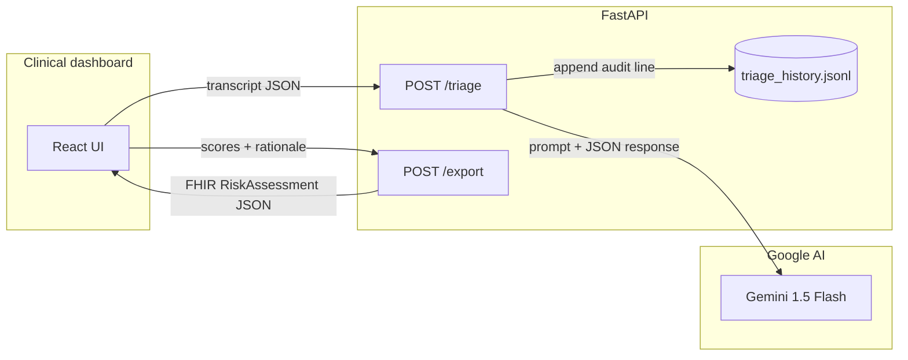

# MediVoice AI 2.0 — Patient–Doctor Link

**Hook ’em Hacks — patient-centered scheduling with Gemini as the clinical orchestrator.**

## What this is

MediVoice AI 2.0 is a deliberately **lean** stack: **no on-box ML**, no scikit-learn, no SHAP, no heavy feature pipelines. The **Google Gemini** API performs triage-style reasoning from a **voice transcript** (text in the demo). The backend returns a numeric **risk score**, a **priority band (P1–P3)**, and **plain-language rationale** for the care team. A second endpoint materializes the same decision as a **HL7 FHIR R4 `RiskAssessment`** resource for interoperability demos and “download the record” workflows.

This architecture avoids **503 / OOM** patterns common to embedding large models or SHAP explainers on small hosts: work is **short, asynchronous I/O** to Gemini plus JSON serialization.

## Architecture (Gemini orchestration)



1. **`POST /triage`** — Accepts `voice_transcript` (and optional patient fields). Calls Gemini with a **JSON-shaped** answer: `risk_score`, `priority`, `clinical_rationale`, `next_steps`. If no API key is present, a **deterministic rule fallback** keeps the demo runnable offline.
2. **`POST /export`** — Accepts structured triage fields and returns a **minimal valid FHIR `RiskAssessment`** JSON (status, subject, occurrence, prediction).
3. **Audit** — Every triage is appended to **`backend/data/triage_history.jsonl`** with a timestamp and excerpt for traceability.

**Deployment:** FastAPI listens on **`0.0.0.0`** and **`PORT`** (Render-compatible). **CORS** is open for hackathon frontends.

## Frontend

The UI is a **three-column**, Apple Health–inspired layout: **incoming queue**, **transcript + Gemini reasoning + next steps**, and **clinic load heatmap + ranked “OR-Tools style” slots** (synthetic / heuristic for the demo when OR-Tools is not bundled in the minimal backend). Actions: **Download FHIR**, **Mark resolved** (local UI state), **System status** (`GET /health`).

Styling uses **inline + embedded CSS** in `App.jsx` so the app runs without extra Tailwind config; **`tailwindcss`** is listed in `package.json` for teams that want to add PostCSS later.

## Quick start

**Windows PowerShell** (5.x does not support `&&`; use separate lines or `;`). Use **`$env:VAR`** for environment variables, not `set` (that is **cmd.exe**).

```powershell
cd backend
python -m venv .venv
.\.venv\Scripts\Activate.ps1
pip install -r requirements.txt
$env:GEMINI_API_KEY = "your_actual_key_here"
python main.py
```

```powershell
# Frontend (second terminal)
cd frontend
npm install
npm run dev
```

If you use **cmd.exe**: `set GEMINI_API_KEY=your_key` then `python main.py`. In **PowerShell 7+**, `cd backend; pip install -r requirements.txt; $env:GEMINI_API_KEY="..."; python main.py` works.

**macOS / Linux (bash)**

```bash
cd backend && python -m venv .venv && source .venv/bin/activate \
  && pip install -r requirements.txt && export GEMINI_API_KEY=your_key && python main.py
```

```bash
cd frontend && npm install && npm run dev
```

Open the app (default **http://127.0.0.1:3000**). Vite **proxies** `/triage`, `/export`, and `/health` to **http://127.0.0.1:8000** during development.

For production builds, set **`VITE_API_BASE`** to your public FastAPI URL (no proxy).

## Repository layout (core)

| Path | Role |
|------|------|
| `backend/requirements.txt` | FastAPI, Uvicorn, `google-generativeai`, Pydantic, multipart |
| `backend/main.py` | Gemini orchestration, `/triage`, `/export`, audit log, CORS, `$PORT` |
| `frontend/package.json` | React, Lucide, Framer Motion, Axios, Tailwind (tooling) |
| `frontend/src/App.jsx` | Clinical dashboard UI |
| `README.md` | This document |

Minimal Vite entry files (`index.html`, `src/main.jsx`, `vite.config.js`) are included so `npm run dev` works out of the box.

## License

Demo / educational use. Not for real clinical decisions without proper validation and governance.
